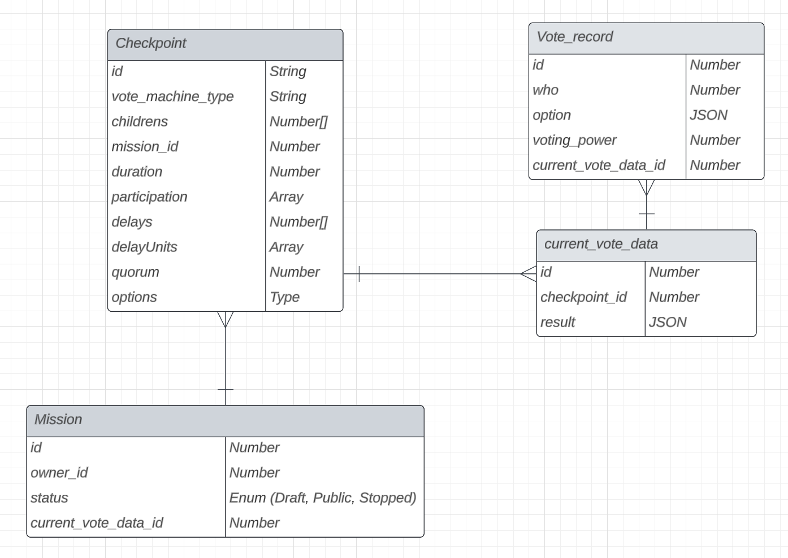
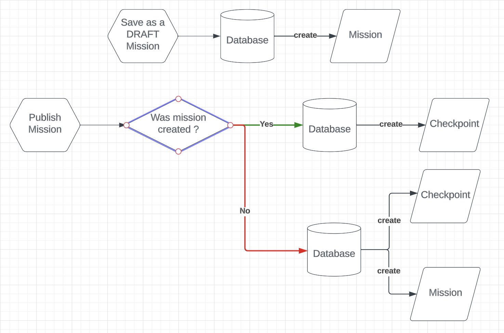
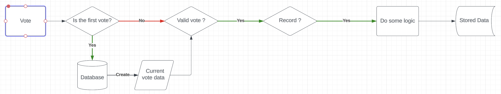
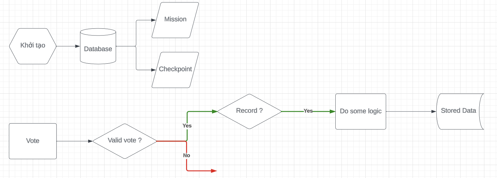
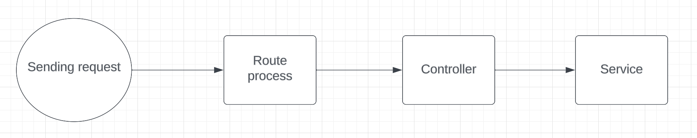

# Draft structure

## Database design

<<<<<<< HEAD
## Create proposal flow

## Vote flow

=======
## Flow (Updating...)

>>>>>>> main

## Code structure

1. Client send a request to server
2. Route will direct the request
3. The controller receives the request and gives it to the service to process
4. Controller will return response
